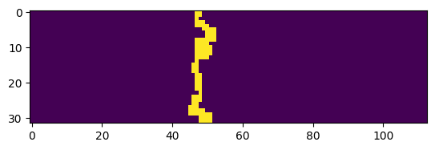
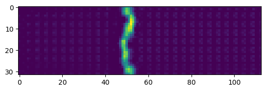

# **FireCast**: Wildfire Spread Prediction

**Abstract**: *This code is the solution implements a spatiotemporal prediction model for a flame propagation prediction challenge in [2024 FLAME AI Challenge *(Kaggle Competition)*](https://www.kaggle.com/competitions/2024-flame-ai-challenge) which ranked 47th out of 178 teams . 

The code loads training and test data containing various physical parameters (theta, ustar, xi_f, etc.) related to flame propagation. It processes this data by stacking and normalizing different features, creating sequences where each input has 6 time steps to predict the next 20 time steps. The model uses ConvLSTM (Convolutional Long Short-Term Memory) architecture from the OpenSTL library, which is specifically designed for spatiotemporal learning tasks. The data is split into training and validation sets, processed in batches, and the model is trained for 12 epochs. After training, the model makes predictions on the test set, and the results are formatted into a submission file. The model essentially learns to predict how the flame will propagate over time based on initial conditions and physical parameters, and thus a **MSE of 0.01215** across diverse conditions.

## Plots

#### Prediction

| Input  | Prediction |
|--------|-----------|
|  |  |
